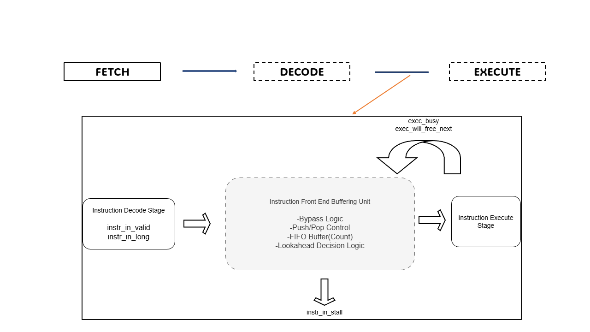
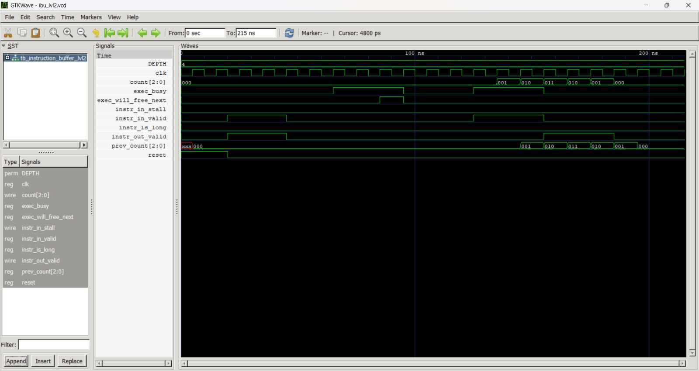

# RISC-V Instruction Front-End Buffering Unit  
**EL Phase-2 Project – Computer Architecture**

---

## Student Details
- Name: R.Chithra  
- Department: Electronics and Communication Engineering  
- College: RV College of Engineering  
- Course Name: Computer Architecture  
- EL Title: RISC-V Instruction Front-End Buffering Unit

## Team and Work 

Details regarding team members and brief report of work for this EL Phase-2 project are documented in the following file:

**[Team & Work Details (PDF)](Team_&_Work.pdf)**


---

## 1. Introduction

In a RISC-V processor, the instruction decode stage and the execution stage do not
always operate at the same speed. Execution can remain busy due to multi-cycle
instructions, while the decode stage may continue generating instructions.

To handle this mismatch without losing instructions or introducing unnecessary
execution stalls, an **Instruction Front-End Buffering Unit** is used. This unit
temporarily stores instructions when execution is busy and releases them when
execution becomes available.

This project implements and verifies an optimized **Level-2 Instruction
Front-End Buffering Unit** for a RISC-V processor.

---

## 2. Objective of the Project

The main objectives of this project are:
- To design a front-end instruction buffering unit for a RISC-V processor
- To improve instruction throughput
- To avoid execution bubbles
- To preserve FIFO ordering of instructions
- To verify correctness using simulation, output analysis, and waveform inspection

---

## 3. Block Diagram

The following block diagram shows the position of the Instruction Front-End
Buffering Unit within the RISC-V front-end and its interaction with the decode
and execution stages.



---

## 4. Algorithm Overview (Level-2)

The Instruction Front-End Buffer improves upon a basic buffer by introducing
execution look-ahead and bypass optimization.

The algorithm operates as follows:

1. The execution stage is checked to determine whether it can accept a new
   instruction (either free or will become free in the next cycle).
2. Short instructions are allowed to bypass the buffer directly when execution
   is ready and the buffer is empty.
3. Instructions are pushed into the buffer when bypass is not possible.
4. Buffered instructions are popped and issued when execution becomes available.
5. The buffer count is updated synchronously at the **positive edge of the clock**
   based on push and pop decisions.

This approach ensures maximum utilization of the execution unit while maintaining
correct instruction order.

---

## 5. Repository Structure

The repository is organized in a structured manner to clearly separate the
design files, verification environment, and simulation results.

- The `rtl` folder contains the SystemVerilog implementation of the
  Instruction Front-End Buffering Unit.
- The `tb` folder contains the testbench and monitor modules used for
  functional verification of the design.
- The `results` folder contains the simulation outputs, including the block
  diagram, output table, waveform screenshots, and result analysis files.

---

## 6. Simulation Output

The Instruction Front-End Buffering Unit was simulated using a structured
testbench to validate its functional correctness under different operating
conditions.

The simulation output captures cycle-by-cycle behavior, including instruction
validity, instruction type, execution availability, push and pop operations,
bypass decisions, and buffer occupancy count. These results confirm that the
buffer operates according to the designed Level-2 algorithm.

A detailed explanation of the simulation output table is provided in the
following file:

- `results/output_analysis.txt`

The snapshot of the simulation output table generated during execution is shown
below.


---

## 7. Simulation Waveform

The timing behavior of the Instruction Front-End Buffering Unit was verified
using GTKWave. The waveform confirms correct timing of push, pop, and bypass
operations, as well as correct buffer count updates at the positive edge of the
clock.

The GTKWave waveform snapshot corresponding to the simulation is shown below.



---

## 8. How to Run the Simulation

### Requirements
- Icarus Verilog
- GTKWave (optional, for waveform visualization)

### Simulation Commands
```bash
iverilog -g2012 rtl/instruction_buffer_lvl2.sv tb/ibuf_lvl2_monitor.sv tb/tb_instruction_buffer_lvl2.sv
vvp a.out
gtkwave instruction_buffer_lvl2.vcd
